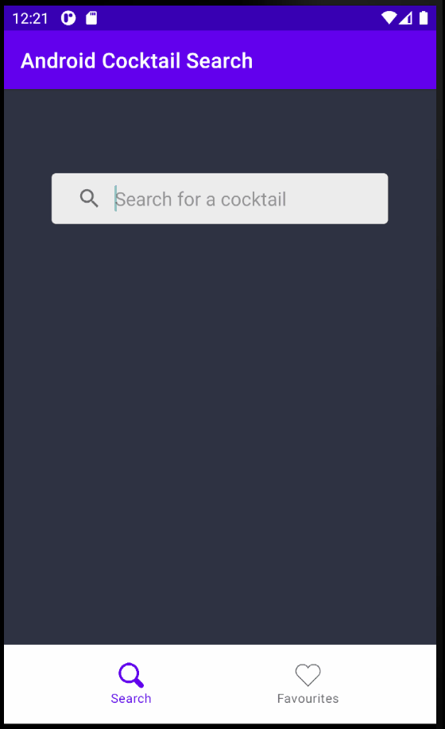

# Mobile_Development_CA1
<b>Download here:</b> https://github.com/jakewarrenblack/Android-Cocktail-Search/releases/tag/v1.0.0

Android application written in kotlin and designed to MVVM architecture. API calls using Retrofit and persistent local SQLite database using Room. Search for a cocktail for a list of possibilities. Save/unsave cocktails using the heart icon to add or remove cocktails from the favourites page.

